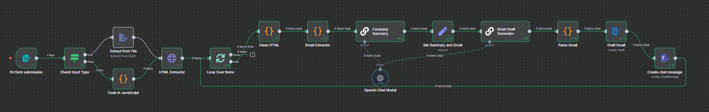
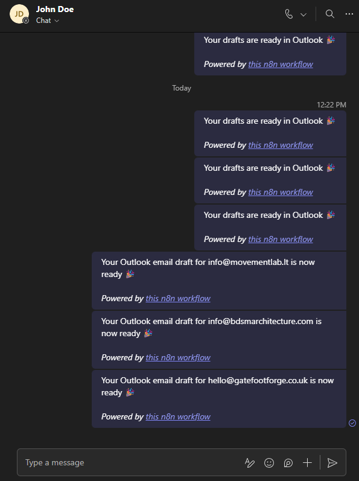

# Website Outreach Automation AI (n8n + Microsoft Graph)

This repository contains a full **AI-powered website→summary→email draft→Teams notification** automation workflow built in **n8n**.

It accepts website URLs (Excel upload or text list), scrapes each site, extracts useful information, uses an LLM to generate a concise company summary and personalized outreach email, creates Outlook email drafts through Microsoft Graph, and sends Teams notifications when drafts are ready.



---

## 🚀 Features

- Upload **Excel (.xlsx/.csv)** files containing URLs
- Or paste website URLs directly
- Website HTML extraction and cleaning
- **AI-generated company summaries** (LLM via OpenRouter)
- **AI-personalized outreach email drafting**
- Automatic **Outlook draft** creation (Graph API)
- **Teams message** notifications for each completed draft
- Fully compatible with **localhost n8n setups**

---

## 📸 Sample Output

### Outlook Drafts


### Teams Notifications


---

## 📂 Included in This Repository
```
workflow/
└── website-outreach-automation.json
screenshots/
├── workflow-overview.png
├── outlook-drafts.png
└── teams-notifications.png
```

---

## 🧩 How the Workflow Operates

1. **Input Stage**
   - Users upload an Excel/CSV file
   - Or provide a list of URLs manually

2. **Branching Logic**
   - Workflow detects input type
   - Routes to XLSX parser or text list parser

3. **Website Processing**
   - HTML extracted
   - HTML cleaned
   - Contact email extracted (regex)

4. **AI Tasks (via OpenRouter LLM)**
   - AI-generated company summary
   - AI-generated outreach draft
   - Tone constraints ensure warm, concise, human messages

5. **Microsoft Graph Automation**
   - Creates Outlook drafts
   - Sends Teams chat messages (requires existing chat)

6. **Completion**
   - User receives Teams notification with draft details

---

## 🔐 Credentials Required

- **Azure App Registration**
  - Must be set to **Multi-tenant**
  - Must use **Client Secret Value**, not Secret ID
  - Must allow:
    - Mail.ReadWrite
    - Mail.Send
    - Chat.ReadWrite
    - offline_access

- **Microsoft Business Account**
  - Used instead of Developer Program (phone verification issue)

- **Microsoft Outlook OAuth2 Credential (n8n)**
  - Not "Microsoft OAuth2" — needs the dedicated Outlook connector

- **OpenRouter API Key**
  - Used instead of OpenAI for reliability

---

## 📝 Developer Notes

- n8n workflow built and tested on **localhost**
- Created a second Teams user because 1:1 chat automation works only if a chat already exists
- Using OpenRouter eliminated quota issues from OpenAI
- Azure app had to be set to **multitenant** for OAuth to work
- Secret **Value**, not **ID**, must be used in n8n
- Teams channel posts are easier, but this workflow uses 1:1 chat

---

## 📥 How to Import the Workflow

1. Open n8n
2. Go to **Settings → Import Workflow**
3. Select `website-outreach-automation.json`
4. Configure:
   - Outlook OAuth2
   - Teams OAuth2
   - OpenRouter API

Done ✔️

---

## 📄 License

MIT
